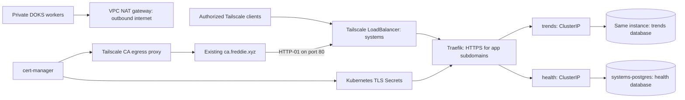

# systems-deployment

Terraform for one DigitalOcean Kubernetes cluster named **systems**, with private-only worker IPs, one managed PostgreSQL primary shared by Health and Trends, and a Tailscale load balancer serving **health.freddie.xyz** and **trends.freddie.xyz**.

**Live:** Health and Trends run in DOKS from immutable DOCR images, backed by separate databases on the shared PostgreSQL instance. Their DNS-only A records point to the Tailscale gateway `100.91.90.6`. Google Secret Manager holds deployment and integration credentials. See [the deployment record](docs/deployment.md) and [migration/rollout runbook](docs/migration.md).



## Deployment layout

| Directory | Resources |
| --- | --- |
| `infra/` | `systems` VPC in `nyc1`, default NAT gateway, DOKS with isolated workers and a control-plane firewall, one PostgreSQL primary, two databases and logins, database trusted-source firewall, Basic DOCR registry in `nyc3` |
| `kubernetes/` (Helm directly) | Tailscale Operator, local `systems` Helm chart, Traefik Gateway API, cert-manager and TLS Secrets, private CA routing, cert-manager DNS resolver, network policies, app Deployments and Google workload identity configuration |

Terraform manages only DigitalOcean resources in `infra/`. Kubernetes resources are installed separately by `kubernetes/deploy.sh` using Helm; there are no Helm or Kubernetes Terraform providers or resources. Create infrastructure and obtain a working kubeconfig before deploying Kubernetes configuration. Application images and database migrations belong in their application repositories. CI validates configuration with mocked providers and never applies infrastructure.

Default capacity is two `s-2vcpu-4gb` workers and one `db-s-1vcpu-2gb` PostgreSQL primary, with no database standby. Traefik, each app, and each standalone Tailscale proxy run one replica. Updates and failover can interrupt requests; two workers do not make every component highly available. App replicas stay at one because the apps currently run background work inside their processes.

## Networking and HTTPS

- Workers use `isolated_workers = true`, available for new DOKS 1.36+ clusters in public preview. A default DigitalOcean VPC NAT gateway supplies outbound traffic for provisioning, image pulls, Tailscale, and external APIs. A VPC by itself does not remove public worker IPs. [DOKS isolated workers](https://docs.digitalocean.com/products/kubernetes/how-to/create-clusters-with-isolated-worker-nodes/)
- The DOKS API endpoint remains public with a restrictive firewall. `admin_cidrs` must contain the administrator/runner's **public egress** address, not its `100.x` Tailscale address. Terraform also allows the cluster NAT's allocated IPv4 address so isolated workers can bootstrap. The operator exposes an API proxy as `systems-operator` using `noauth` mode: it passes through Kubernetes credentials and RBAC, not anonymous cluster access. The example tailnet grant limits it to the owner. [API server proxy](https://tailscale.com/docs/kubernetes-operator/api-server-proxy)
- The only application `LoadBalancer` uses `loadBalancerClass: tailscale`, with NodePort allocation disabled. There is no public DigitalOcean load balancer or Tailscale Funnel. Network policies permit the Tailscale namespace to reach Traefik, and Traefik to reach app ports. App egress remains available for external integrations.
- VPC `10.70.0.0/20`, services `10.71.0.0/20`, pods `10.72.0.0/16`. Confirm these do not overlap existing VPCs or advertised tailnet routes before creation. The gateway's private DNS service reserves `10.71.0.53`.
- PostgreSQL uses its **private hostname**, a Kubernetes trusted-source firewall rule, and `sslmode=verify-full` with the DigitalOcean database CA. The managed service may still have a public hostname; this repository does not publish it to applications or allow world access. App-level database isolation is established and tested by the bootstrap job, not merely by creating two logins.

Existing private PKI is retained: cert-manager gets certificates from `https://ca.freddie.xyz/acme/acme/directory`, trusting the public root in `kubernetes/charts/systems/files/root_ca.crt`. Root SHA-256: `53de014733269d464ed65fac577936986355e2a55cf3d0ae81623aacf8daeab4`. No CA signing key is copied.

Traefik `v3.7.12` watches the Gateway API. The `systems` Gateway has one HTTP listener and a hostname-specific HTTPS listener for each app. Its `certificateRefs` point to `health-tls` and `trends-tls` Secrets in the same namespace. HTTPRoutes attach app backends and redirect HTTP GET/HEAD to HTTPS; unmatched HTTP writes receive 404. Disabled apps have no backend HTTPRoute. The dashboard, Ingress provider and Traefik-specific CRD provider are disabled.

cert-manager `v1.21.1` owns those TLS Secrets and renews 24-hour certificates eight hours before expiry. Its namespaced `freddie` Issuer uses the **Gateway API HTTP-01 solver**, creating temporary HTTPRoutes under the Gateway's port-80 listener. The existing CA offers HTTP-01 only. Traefik watches Secret changes and reloads certificates automatically, with no ACME files or persistent certificate volume. [cert-manager Gateway HTTP-01](https://cert-manager.io/docs/configuration/acme/http01/)

A dedicated DNS service at `10.71.0.53` resolves the CA hostname through its Tailscale egress Service and app hostnames through the gateway ClusterIP for cert-manager's self-checks. Only cert-manager uses this DNS configuration; DOKS-managed CoreDNS is unchanged. The CA validates the real app DNS through Tailscale on TCP 80. Network policies permit both the controller's self-check and Traefik's access to temporary solver pods.

The deployment script installs the checksum-pinned Gateway API `v1.6.1` standard bundle before either controller. DOKS's older bundled CRDs are upgraded using its documented `doks.digitalocean.com/install-policy: external` annotation. The installer refuses to downgrade newer CRDs or remove a stored API version. It manages API definitions, without changing DOKS's Cilium configuration. [DOKS third-party Gateway support](https://docs.digitalocean.com/products/kubernetes/how-to/use-gateway-api/)

## Validate locally

Requires Terraform 1.16.1 (minimum supported by configuration: 1.11), Helm 3.19.0, Python 3.12+, and Make. Applying also requires `doctl`, `kubectl` matching the cluster version, DigitalOcean credentials, and Tailscale operator credentials. `scripts/with-doctl.py` also uses PyYAML from `requirements-dev.txt`.

```sh
python3 -m venv .venv
. .venv/bin/activate
pip install -r requirements-dev.txt
make init check
```

Provider locks are committed. Tests exercise private-cluster settings, firewall validation, image/migration gates, rendered service exposure, probes, and secret URL handling without cloud credentials. They do not prove live DOKS availability, SQL permissions, Cilium compatibility, or CA renewal.

## Provisioning runbook

Use these commands to reproduce or update the deployment. See the deployment record for what has actually been applied.

1. Confirm region, worker/database sizes, Kubernetes versions, NAT availability, private-worker preview availability, and non-overlapping networks in the DigitalOcean account. Check current billing for workers, NAT, database, persistent volume, and any control-plane charges. [Kubernetes pricing](https://docs.digitalocean.com/products/kubernetes/details/pricing/) · [NAT pricing](https://docs.digitalocean.com/products/networking/vpc/details/pricing/)

2. Select where state will live before applying. The infrastructure root uses local state for a single administrator; use `umask 077`, owner-only storage and encrypted backups. State and saved plans can contain database passwords and DOKS credentials even when outputs are marked sensitive. For collaboration, configure an encrypted remote backend with locking, and migrate existing infrastructure state. Helm stores release state in the cluster. Never commit state, credentials, local tfvars or plan files.

3. Use the existing credential in doctl’s `freddie-pki` context and replace the example administrator CIDR. The wrapper reads that token into the child environment without printing it or saving it in Terraform configuration:

   ```sh
   umask 077
   cp infra/terraform.tfvars.example infra/terraform.tfvars
   # Edit infra/terraform.tfvars with real account settings.
   terraform -chdir=infra init
   python3 scripts/with-doctl.py --context freddie-pki terraform -chdir=infra plan -out=systems.tfplan
   python3 scripts/with-doctl.py --context freddie-pki terraform -chdir=infra apply systems.tfplan
   doctl --context freddie-pki kubernetes cluster kubeconfig save systems
   ```

   VPC, cluster, database instance, and app databases have `prevent_destroy`. Replacements require deliberate code changes and a backup/restore plan. Avoid broad `-target`/destroy operations.

4. Verify the cluster and networking before installing Tailscale:

   ```sh
   doctl --context freddie-pki kubernetes cluster get systems --output json
   bash scripts/preflight.sh do-nyc1-systems
   ```

   Check `isolated_workers=true` in the DigitalOcean response as well as the worker addresses. The preflight fails if Cilium's kube-proxy replacement cannot be verified compatible with Tailscale L4 Service proxies. Tailscale requires socket LB bypass in pod namespaces; DigitalOcean manages Cilium and warns against patching it. Obtain a supported configuration from DigitalOcean if this check fails. [Tailscale Cilium requirements](https://tailscale.com/docs/features/kubernetes-operator) · [DOKS managed components](https://docs.digitalocean.com/products/kubernetes/details/managed/)

5. Merge `tailscale/policy.example.hujson` into the existing tailnet policy, replacing the owner login placeholder and verifying the CA's current tailnet address. Existing broad grants are additive: they must also be reviewed to maintain owner-only application access. The operator credentials are stored under the two resource names in `kubernetes/google-secrets.yaml` (project `186933910776`). The staged OAuth client has Devices/Core, Auth Keys, and Services write scopes with all three systems tags; `operatorConfig.defaultTags` matches that set. The proxy tags must be owned by `tag:systems-operator` in the tailnet policy. See [Kubernetes configuration](kubernetes/README.md) for tag matching and rotation, and the [operator install guide](https://tailscale.com/docs/kubernetes-operator/install-operator). Enable tailnet HTTPS for the API proxy if it is not already enabled. If device approval or Tailnet Lock is enabled, approve/sign the operator and its proxies as required.

   ```sh
   # Initial deployment: use the credential supplied on the deployment droplet.
   gcloud auth activate-service-account --key-file=/home/codex/.config/gcloud/codex-trends.json
   python3 kubernetes/bootstrap-google-secrets.py --context do-nyc1-systems --operator-only
   cp kubernetes/values.example.yaml kubernetes/values.local.yaml
   bash kubernetes/deploy.sh do-nyc1-systems kubernetes/values.local.yaml
   ```

   Keep both `apps.*.enabled` flags and `postgresMigrationVerified` set to `false`. Once Tailscale credentials are available, the gateway has no app backend routes and certificate issuance may retry until CA validation DNS targets it. This does not change existing DNS or the droplet.

6. Initialize database grants and Kubernetes Secrets:

   ```sh
   python3 scripts/bootstrap-database.py --context do-nyc1-systems
   python3 scripts/publish-database-secrets.py
   ```

   The script reads sensitive Terraform outputs through a pipe, runs an ephemeral PostgreSQL client Job in the cluster, verifies each login can connect to its own database and cannot connect to the other, and then writes `health-database` and `trends-database` Secrets. Database access uses the private endpoint with certificate verification. The admin Secret and Job are removed on completion or failure. A forced process termination may require manually deleting resources named `database-bootstrap-*`. Rerun after a password/CA rotation and restart the affected app pods; environment variables do not update in existing pods.

7. Follow the [app schema migration and rollout runbook](docs/migration.md). Build and push both images to DOCR, synchronize Google secrets, configure Trends workload federation, and initialize new PostgreSQL databases with the apps' versioned migration commands. Existing production databases are already initialized. Production deployment uses `kubernetes/values.production.yaml`; the chart's default/example values remain disabled for safe initial provisioning. See [secret ownership and rotation](docs/secrets.md).

## DNS and certificate cutover

DNS is intentionally a separate cutover step because application data and certificates must be ready before traffic switches. Keep **DNS only** (no Cloudflare proxy). Obtain the new Tailscale IPv4 from the `systems` device in the Tailscale admin console or from Service status if populated:

```sh
kubectl --context do-nyc1-systems -n systems get service systems-gateway -o json
```

The status may report a MagicDNS hostname; resolve it from a tailnet client to get its `100.x` address. At cutover, replace the existing `100.66.233.125` A-record targets for **health** and **trends** with that address. Check for stale AAAA records. The apex `freddie.xyz` and CA DNS are unaffected. Devices still need Tailscale access and the Freddie root installed.

HTTP-01 is a two-way dependency: cert-manager must reach the CA, and the CA's DNS must resolve each application hostname to the new gateway. A client-side `curl --resolve` alone does not satisfy CA validation. Before cutover, use a deliberate temporary DNS override on the CA resolver to issue and test certificates while normal users stay on the droplet; remove it once DNS is switched. Otherwise budget an issuance window during cutover. Verify certificate renewal across the existing short certificate lifetime, including after a gateway restart. Changing/deleting a Tailscale proxy's Kubernetes identity can change its tailnet IP and require a DNS update.

Back up cert-manager's `freddie-acme-account`, `health-tls`, and `trends-tls` Secrets along with operator-managed Secrets that contain Tailscale device identity. The old `systems-caddy-data` PVC is retained, unmounted, only for recovery from the previous gateway implementation; it is no longer part of the chart. Application rollback keeps the current PostgreSQL databases and restores a compatible image. Restoring an older database backup requires reconciling subsequent writes.
